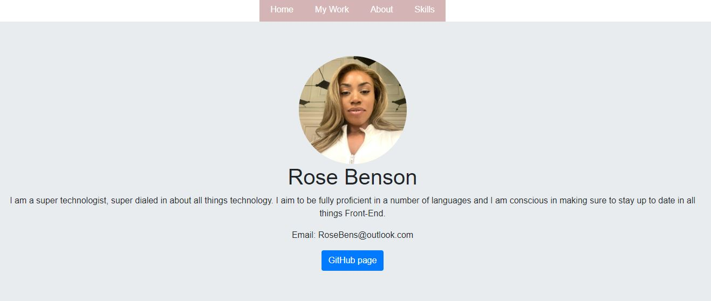

# Bootstrap-Portfolio

## Description

Get to know me with my Bootstrap Portfolio which I have created from scratch with the assiatance of Bootstrap.
I have linked my taps to each section ensuring a smooth UX and ensured to make my portfolio engaging with my use of HTML.

## Table of Contents 

- [Usage](#usage)
- [Creator](#creator)
- [Technologies](#technologies)
- [License](#license)

## Usage

#### Access the application on: - 

[Link to deployed page]()

## Creator

- Benson, Rosemary [Github Link](https://github.com/RoseBenson)

## Technologies 

- HTML
- CSS
- Bootstrap

## License

